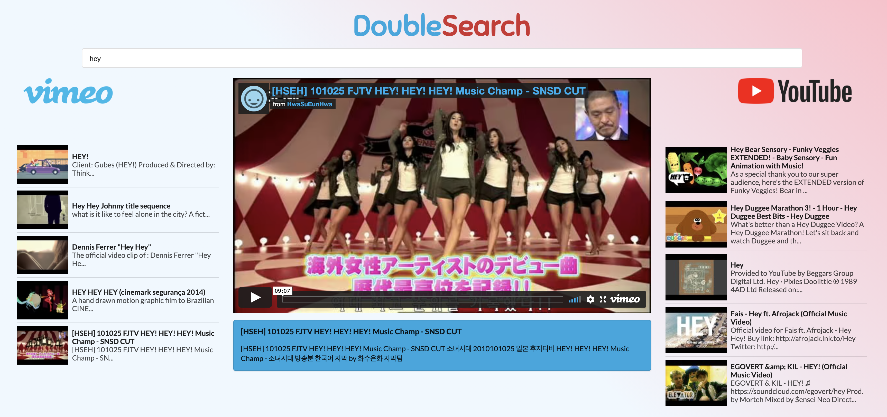

# DoubleSearch

This applet allows the user to enter a term in the search bar and visualise results from both Youtube and Vimeo.
Using React JS and Axios, a double API request is sent and then data is crunched to select the video that the user interacts with, to be visualise in the center embedded player.

